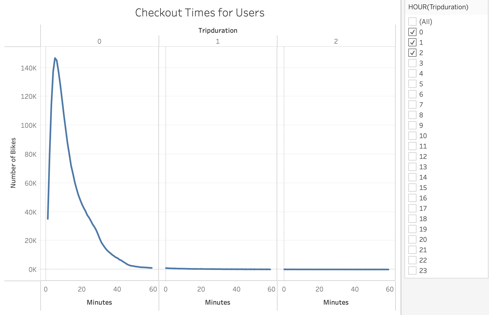
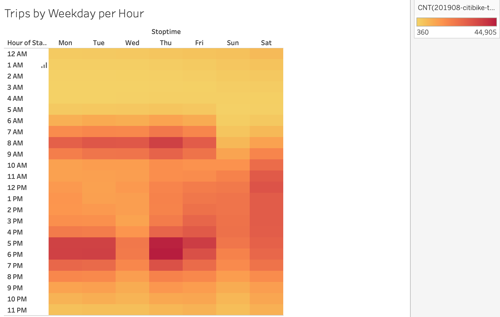
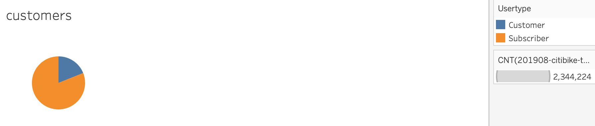
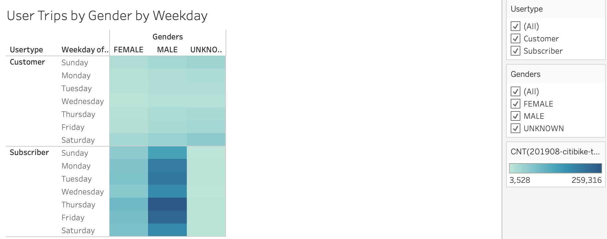
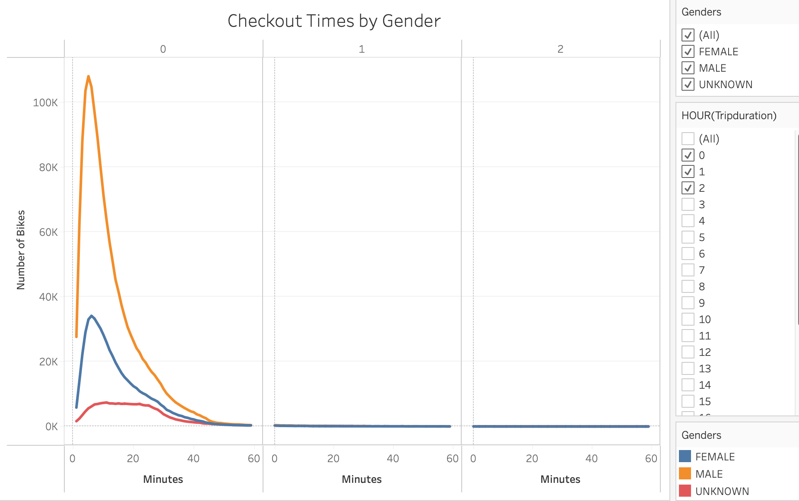
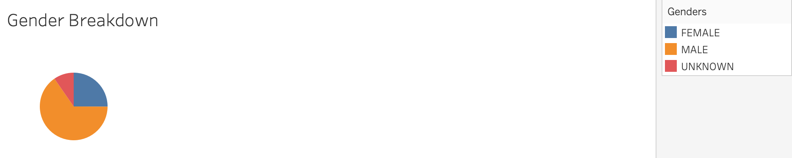

# Citibike Customer Data Analysis

## Overview

The purpose of this analysis is to utilize publically available data from New York City based bike rental service Citibike to determine if a similar service would be viable in or hometown of Des Moines. By using the information gathered about each individual rental placed in the month of August 2019, a month which would expect to see a good deal of business given the summer months and tourism bump, we can predict if this service would have a future in the greater Des Moines area.

## Results

This analysis paints a convicing picture of the nature of the business being done by Citibike in New York, but would require some similar data, particularly demographic data, about Des Moines in order to have a convincing argument about whether this could work in Des Moines or not. What we can determine from the data is that Citibike is predominantly being used by people as transportation to and from work and being rented using the subscription model, and that the overwhelming majority of their customers are male.

These three visualizations, which show both how long customers usually rent a bike for, and when they are renting them, make it pretty plain that most of these rentals are being used as means of transportation to get to and from work. By a huge margin the most common amount of time to rent a bike for is well under an hour, and most of these rentals are happening before 8am and after 5pm on weekdays, with the weekends seeing more spread out rentals throughout the day. This is reflected in the percentage of customers who utilize the service on a subscription basis, which also suggests that most peopel are using these bikes as transportation, not in a more casual touristy way.

.png)

The four visualizations above all show that any way you slice it, the majority of customers renting from Citibike are male. No matter what day, or what time of day, it's mostly men renting these bikes. This is reflected both in the breakdowns seen across time rented and amount of time rented, but also in the most basic calculation of number of customers by gender, which shows that approximately 5/8 of their customers are male, which is well above the half you could reasonably expect.

## Summary

While the significance of the gender breakdown for this service is unclear, it is inarguable that unless a similar service could cater to working individuals in a relatively compact downtown area, it would struggle to find the success Citibike has. The backbone of their business is clearly customers who pay them on a subscription basis and utilize their services almost daily for basic transportation, and unless we could make our bike rental service equally attractive for people looking for an alternative way to travel besides a car, customers will likely be hard to come by. To further our understading of whether or not Des Moines could support this type of business, I'd like to see visualiztions exploring the population living in Des Moines' downtown area and also working there to see if there are people who could use these bikes as daily transportation. I'd also like to see a more general comparison of the area of New York and the area of Des Moines, given that coastal cities tend to be more compact and a Midwestern city like Des Moines might be more likely to sprawl out and thusly be a less attractive for bikers. My initial thoughts are not promising on the possibility for success, but with further consideration of how similar the working populations of New York and Des Moines are I could be convinced otherwise.

### Tableau Workbook

To view the visualizations in their entirety with interactive elements, click the link below:

[Link to dashboard](https://public.tableau.com/app/profile/ryan.jarvis4970/viz/CitibikeAnalysis_16795390240480/CitibikeStory?publish=yes)
